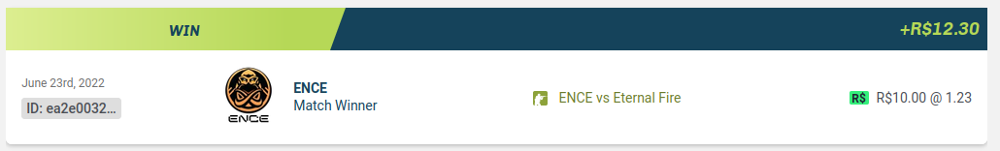
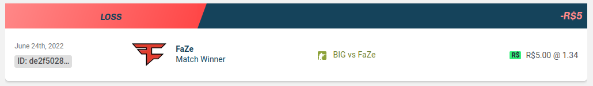
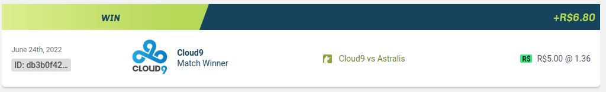
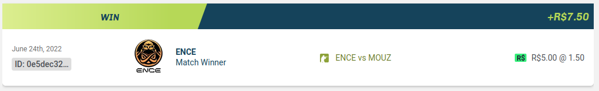
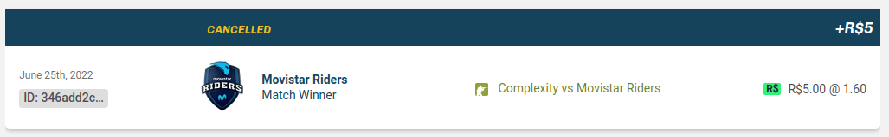
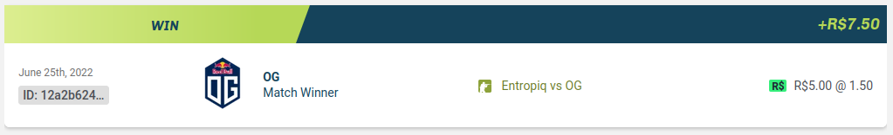
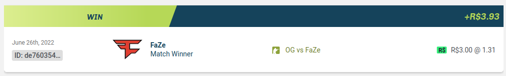
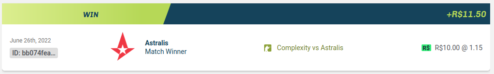
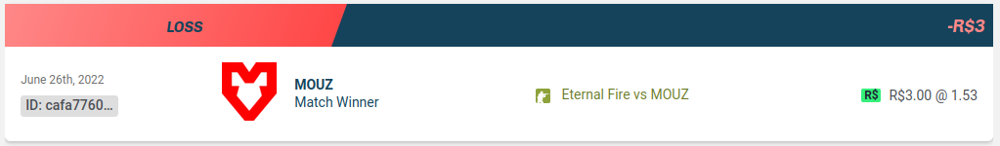

# June 23rd, 2022

Initial Balance: **120 BRL**

We decided to bet R$5 in matches which winning probabilities bewteen 60% and 70%, and 10 BRL in matches with probabilities above 70%. Also to not bet in brazilian matches. We're betting only in Roobet Cup.

Final Balance: **122.30 BRL**

# June 24rd, 2022

Initial Balance: **122.30 BRL**

Final Balance: **121.60 BRL**

# June 25rd, 2022

Initial Balance: **121.60 BRL**

Final Balance: **124.10 BRL**

# June 26rd, 2022

Initial Balance: **124.10 BRL**

We reduced bet from 5 BRL to 3 BRL for matches between 60% and 70% of winning probability. Trying to reduce loss risk

Final Balance: **123.53 BRL**
