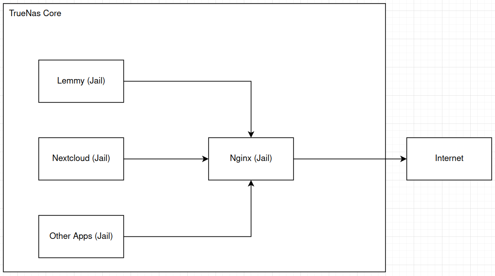
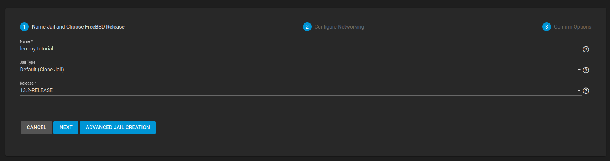
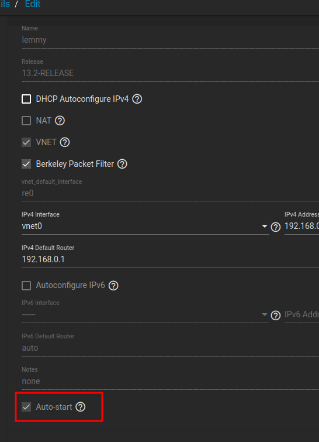
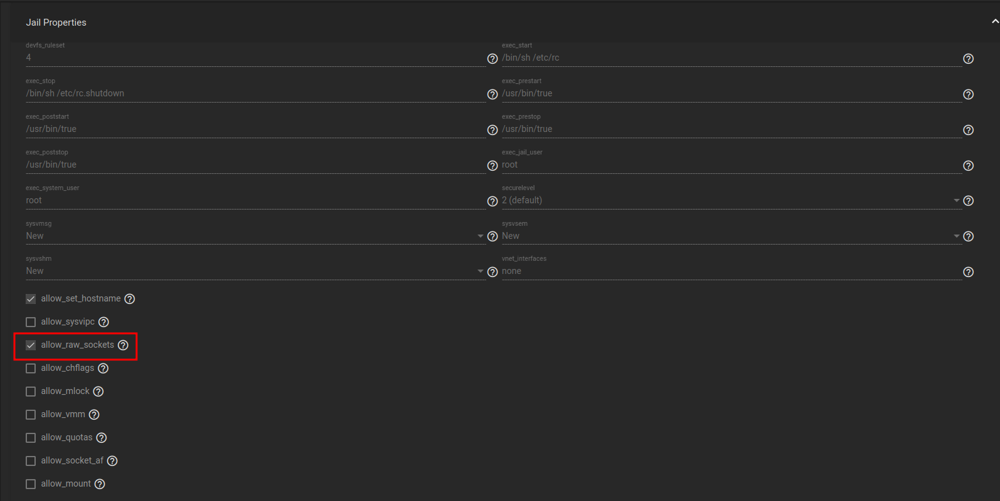

If you use Truenas Core and like to self-host stuff, you'll probably encounter some software
that simply does not play well with FreeBSD, or even compile for it. Most software is written
with Linux in mind, and some of them require modifications to run on Truenas.

Some may say "Just use Trunenas Scale instead" but in my experience, I could never get the stability
of FreeBSD on the Debian variant. Kubernetes was failing often and recovery from a failure proved to be
much harder. As my primary use is file hosting and Nextcloud, I'd rather spin up VMs than using
Truenas Scale.

After going through many tutorials and combining pieces of information to self host Lemmy (which took a good amount of time),
I decided to write this post to share a more concise way to get it working (and for me to not forget as well).

## My architecture

Here's how I'm hosting my apps at the moment. This guide will assume this architecture, you'll need to adapt to your
use case.



Lemmy itself is composed of some components:
- Potsgres
- Lemmy
- Lemmy-ui
- Nginx

So we'll be covering each of those components in the sections below.

Note: This installation does not cover pictrs, if I ever need it I'll add it later.

## Creating the Jail

Here's the step by step on how to configure you jail. If you're not using TrueNas, you can do it by using the command line in FreeBSD.
Change the name, IPv4 address, Netmask and Default Route to match your network.



You also want to enable boot and raw_sockets in the jail. You can do it by changing its configuration:




## Preparations

The first thing that I do on all my jails is to enable ssh root access. You don't need to do this step, but its easier to manage it
from your computer later.

In the jail shell, install nano:

```
pkg install nano
```

Enable sshd:
```
sysrc sshd_enable=yes
```

Generate ssh folder and keys:
```
ssh-keygen
```

Change sshd config to enable root login:
```
nano /etc/ssh/sshd_config
```

and set
```
PermitRootLogin yes
```

And add your Public Key to the authorized_keys file:
```
nano .ssh/authorized_keys
```

Paste your ssh key in the file above

Now you can start ssh:
```
service sshd start
```

And login from your computer to the Jail
```
ssh root@<jail ip>
```

## Runit

I don't understand well the FreeBSD init system. So for this guide I'll use a much simpler approach, that is using Runit with bash scripts.

Install Runit
```
pkg install runit bash
```

Run those commands to run Runit with the FreeBSD init:
```
mkdir /var/service
cp -R /usr/local/etc/runit /etc/runit
echo runsvdir_enable=yes >> /etc/rc.conf
```

Start Runit
```
service runsvdir start
```

## Postgres

I'm basing off [this great guide](https://www.howtoforge.com/how-to-install-postgresql-on-freebsd-12/) on how to get Postgres running on FreeBSD

Install postgres server, client and contrib packages:
```
pkg install postgresql15-server postgresql15-client postgresql15-contrib
```

Enable Postgres:
```
sysrc postgresql_enable=yes
```

Initialize it:
```
/usr/local/etc/rc.d/postgresql initdb
```

Start it:
```
service postgresql start
```

Now let's enable password authentication
Go to Postgres data folder:
```
cd /var/db/postgres/data15
```

Edit the config file:
```
nano pg_hba.conf
```

Go to the bottom, find "ipv4 local connections" and "ipv6 local connections" and change it from `trust` to  `md5`. Your file will look like this:
```
# IPv4 local connections:
host    all             all             127.0.0.1/32            md5  
# IPv6 local connections:
host    all             all             ::1/128                 md5 
```

Now let's create a database and user
Switch to the Postgres user:
```
su - postgres
```

Open PSQL:
```
psql
```

Create lemmy user:
```
create user lemmy with superuser encrypted password '<strong password here>';
```

Create lemmy db:
```
create database lemmy;
grant all privileges on database lemmy to lemmy;
```

Now you have a working postgres connection to work.

## Lemmy

Let's install Lemmy. Mostly of this guide is based out of the [Lemmy official documentation](https://join-lemmy.org/docs/administration/from_scratch.html)

First we need to install some dependencies:
```
pkg install rust git ffmpeg p5-Image-ExifTool gexiv2 ImageMagick7
```

Change to the root directory and clone the repo:
```
cd
git clone https://github.com/LemmyNet/lemmy.git lemmy
cd lemmy
```

Choose a release and build the project:
```
git checkout 0.18.2
git submodule init
git submodule update --recursive --remote
```

Before continuing, you need to manually edit the version being built. The method described in the docs does not work:
```
nano crates/utils/src/version.rs
```

Add or edit the line
```
pub const VERSION: &str = "0.18.2";
```

Now you can build the project
```
cargo build --release
```

You'll also need a lemmy.hjson configuration file. You can create it in the lemmy repo:
```
nano lemmy.hjson
```

Here's the one I use:
```
{
  database: {
    password: "<strong password here>"
  }
  hostname: <your domain here>
  bind: "0.0.0.0"
  federation: {
    enabled: true
  }
}
```

Now you can test it by running:
```
setenv LEMMY_CONFIG_LOCATION /root/lemmy/lemmy.hjson
/root/lemmy/target/release/lemmy_server
```

If everything went correctly, you should be able to browse `http://<jail ip>:8536` and see
some info.

Close the server.

Now we'll use Runit to run it for us.
Create the service folder:
```
mkdir /var/service/lemmy-backend
```

Create the service file:
```
nano /var/service/lemmy-backend/run
```

Here's my content for that file
```
#!/bin/sh -e
exec 2>&1
exec /usr/local/bin/bash /root/lemmy/start_lemmy.sh
```

We need to give execute permissions to that file:
```
chmod +x /var/service/lemmy-backend/run
```

And create the bash script that will start Lemmy:
```
nano /root/lemmy/start_lemmy.sh
```

With this content:
```
export LEMMY_CONFIG_LOCATION=/root/lemmy/lemmy.hjson
/root/lemmy/target/release/lemmy_server
```

Also need to give execute permissions:
```
chmod +x /root/lemmy/start_lemmy.sh
```

Now we can start the service:
```
sv start lemmy-backend
```

If everything went correctly, now you can access the server as before but without running it by yourself.
You can check if the server is running by looking at binded ports:
```
sockstat -l4 -P tcp
```

## Lemmy-ui

Here we'll be dealing with Javascript packages. Some of them will fail when you run this command. Please read
the output, and for optional dependencies you can ignore them, but some will ask you to install some packages manually,
do that and retry the installation step.

First lets go to the root directory:
```
cd
```

Install node, npm and yarn:
```
pkg install node npm yarn
```

Clone the repo:
```
git clone https://github.com/LemmyNet/lemmy-ui.git
```

Checkout to the same version from before:
```
git checkout 0.18.2
```

Install dependencies (it will fail some times, do the required steps and try again):
```
yarn install --pure-lockfile
```

Build the app:
```
yarn build:prod
```

As before, we need to create a service file for it to run. So basically repeting steps
Create the service folder:
```
mkdir /var/service/lemmy-ui
```

Create the service file:
```
nano /var/service/lemmy-ui/run
```

Here's my content for that file
```
#!/bin/sh -e
exec 2>&1
exec /usr/local/bin/bash /root/lemmy-ui/start_lemmy.sh
```

We need to give execute permissions to that file:
```
chmod +x /var/service/lemmy-ui/run
```

And create the bash script that will start Lemmy:
```
nano /root/lemmy-ui/start_lemmy.sh
```

With this content:
```
export LEMMY_UI_LEMMY_INTERNAL_HOST=localhost:8536
export LEMMY_UI_LEMMY_EXTERNAL_HOST=<your domain>
export LEMMY_UI_HTTPS=true
cd /root/lemmy-ui/
/usr/local/bin/node /root/lemmy-ui/dist/js/server.js
```

Also need to give execute permissions:
```
chmod +x /root/lemmy-ui/start_lemmy.sh
```

Now we can start the service:
```
sv start lemmy-ui
```

If everything went correctly, now you can access the server without running it by yourself.
You can check if the server is running by looking at binded ports:
```
sockstat -l4 -P tcp
```

You can access it by going
```
http://<jail ip>:1234
```

## Nginx

Now we need to setup Nginx inside the jail to "glue" everything together. Nginx will allow
to expose one port to the reverse proxy, and will handle communications with lemmy-ui and lemmy-backend.

Install nginx:
```
pkg install nginx
```

Change its configuration file:
```
nano /usr/local/etc/nginx/nginx.conf
```

We'll use a modified version of the `nginx_internal.conf` located in the docker repository. Basically, we're excluding
Lemmy backend port from nginx and changing the upstream services to localhost.
Here's the one I use. You can delete the default one and replace it with this:
```
worker_processes auto;

events {
    worker_connections 1024;
}

http {
    map "$request_method:$http_accept" $proxpass {
        # If no explicit matches exists below, send traffic to lemmy-ui
        default "http://lemmy-ui";

        # GET/HEAD requests that accepts ActivityPub or Linked Data JSON should go to lemmy.
        #
        # These requests are used by Mastodon and other fediverse instances to look up profile information,
        # discover site information and so on.
        "~^(?:GET|HEAD):.*?application\/(?:activity|ld)\+json" "http://lemmy";

        # All non-GET/HEAD requests should go to lemmy
        #
        # Rather than calling out POST, PUT, DELETE, PATCH, CONNECT and all the verbs manually
        # we simply negate the GET|HEAD pattern from above and accept all possibly $http_accept values
        "~^(?!(GET|HEAD)).*:" "http://lemmy";
    }

    upstream lemmy {
        # this needs to map to the lemmy (server) service hostname
        server "127.0.0.1:8536";
    }

    upstream lemmy-ui {
        # this needs to map to the lemmy-ui service hostname
        server "127.0.0.1:1234";
    }

    server {
        listen 1236;

        server_name localhost;
        server_tokens off;

        gzip on;
        gzip_types text/css application/javascript image/svg+xml;
        gzip_vary on;

        # Upload limit, relevant for pictrs
        client_max_body_size 20M;

        add_header X-Frame-Options SAMEORIGIN;
        add_header X-Content-Type-Options nosniff;
        add_header X-XSS-Protection "1; mode=block";

        # Send actual client IP upstream
        proxy_set_header X-Real-IP $remote_addr;
        proxy_set_header Host $host;
        proxy_set_header X-Forwarded-For $proxy_add_x_forwarded_for;

        # frontend general requests
        location / {
            proxy_pass $proxpass;
            rewrite ^(.+)/+$ $1 permanent;
        }

        # security.txt
        location = /.well-known/security.txt {
            proxy_pass "http://lemmy-ui";
        }

        # backend
        location ~ ^/(api|pictrs|feeds|nodeinfo|.well-known) {
            proxy_pass "http://lemmy";

            # proxy common stuff
            proxy_http_version 1.1;
            proxy_set_header Upgrade $http_upgrade;
            proxy_set_header Connection "upgrade";
        }
    }
}
```

Enable and start Nginx:
```
sysrc nginx_enable=yes
service nginx start
```

If everything went correctly, you should be able to browse the UI by going to `http://<jail ip>:1236`

## Reverse proxy

Now we need to expose the server to the internet. On my setup, this is done in another jail, because I run other services
that uses ssl as well. Those steps will probably be different than yours, but you can base on this to create your own config files.

Configure your DNS to point to your IP:
```
<your domain> A <your public ip>
```

Inside Nginx jail, generate a certificate for it
```
certbot --nginx -d <your domain>
```

Now inside your nginx site configuration folder, you can create a entry for the lemmy jail. In my case:
```
cd /usr/local/etc/nginx/sites-enabled/
nano lemmy.brennoflavio.com.br
```

Here's the configuration file I use. Change it to match your configuration:
```
limit_req_zone $binary_remote_addr zone=lemmy.brennoflavio.com.br_ratelimit:10m rate=1r/s;

server {
    listen 80;
    listen [::]:80;
    server_name lemmy.brennoflavio.com.br;
    # Hide nginx version
    server_tokens off;
    location /.well-known/acme-challenge/ {
        root /var/www/certbot;
    }
    location / {
        return 301 https://$host$request_uri;
    }
}

server {
    listen 443 ssl http2;
    listen [::]:443 ssl http2;
    server_name lemmy.brennoflavio.com.br;

    ssl_certificate /usr/local/etc/letsencrypt/live/lemmy.brennoflavio.com.br/fullchain.pem;
    ssl_certificate_key /usr/local/etc/letsencrypt/live/lemmy.brennoflavio.com.br/privkey.pem;


    ssl_protocols TLSv1.2 TLSv1.3;
    ssl_prefer_server_ciphers on;
    ssl_ciphers 'ECDHE-ECDSA-AES256-GCM-SHA384:ECDHE-RSA-AES256-GCM-SHA384:ECDHE-ECDSA-CHACHA20-POLY1305:ECDHE-RSA-CHACHA20-POLY1305:ECDHE-ECDSA-AES128-GCM-SHA256:ECDHE-RSA-AES128-GCM-SHA256:ECDHE-ECDSA-AES256-SHA384:ECDHE-RSA-AES256-SHA384:ECDHE-ECDSA-AES128-SHA256:ECDHE-RSA-AES128-SHA256';
    ssl_session_timeout  10m;
    ssl_session_cache shared:SSL:10m;
    ssl_session_tickets on;
    ssl_stapling on;
    ssl_stapling_verify on;

    # Hide nginx version
    server_tokens off;

    # Upload limit, relevant for pictrs
    client_max_body_size 20M;

    # Enable compression for JS/CSS/HTML bundle, for improved client load times.
    # It might be nice to compress JSON, but leaving that out to protect against potential
    # compression+encryption information leak attacks like BREACH.
    gzip on;
    gzip_types text/css application/javascript image/svg+xml;
    gzip_vary on;

    # Various content security headers
    add_header Referrer-Policy "same-origin";
    add_header X-Content-Type-Options "nosniff";
    add_header X-Frame-Options "DENY";
    add_header X-XSS-Protection "1; mode=block";


    location / {
      proxy_pass http://192.168.0.32:1236   ;
      proxy_http_version 1.1;
      proxy_set_header Upgrade $http_upgrade;
      proxy_set_header Connection "upgrade";
      proxy_set_header X-Real-IP $remote_addr;
      proxy_set_header Host $host;
      proxy_set_header X-Forwarded-For $proxy_add_x_forwarded_for;
    }
}
```

The important points above is to change the server name, the ssl certificate paths and the host/port of the proxy, that
should match the one defined in the Nginx confitguration done before.

## Conclusion

That's it! Now you can access `https://<your domain>` and configure your Lemmy instance. You'll probably want to disable the registration
to prevent your instance from being hammered by bots, or if you plan to keep it open, edit your `lemmy.hjson` file to add an email server and
require email confirmations.

You should also think about:
- Backups
- ZFS Snapshots
- PICRTS

Some gotchas and considerations that I noticed:
- Notifications won't work because most of the time you'll be iteracting to other instances (like `lemmy.world`), and lemmy only sends notifications
from communities created in your home instance.
- To use it on Android, I recommend Thunder. [You can find](https://apt.izzysoft.de/fdroid/index/apk/com.hjiangsu.thunder) it on IzzyOnDroid F-droid Repo
- You won't be anonymous with this approach, as you're tying an instance to your domain, that will reveal your IP, some personal information, etc.
- Some features are not federated. Which means that clients will show incorrect numbers when using this approach. For example, subscriber count
is for your instance only (not across instances), so you'll see all communities with 1 subscriber (you). This is true for any instance.
Thanks!
- To find communities, go to a huge public instance and search from there. Then copy the community id (`!community@lemmy-server`) and paste in your instance search.
Your instance won't find anything at the begginging becuase it does not know other servers. You'll need to use another server to find content, at least intially.
I use `https://lemmy.world`