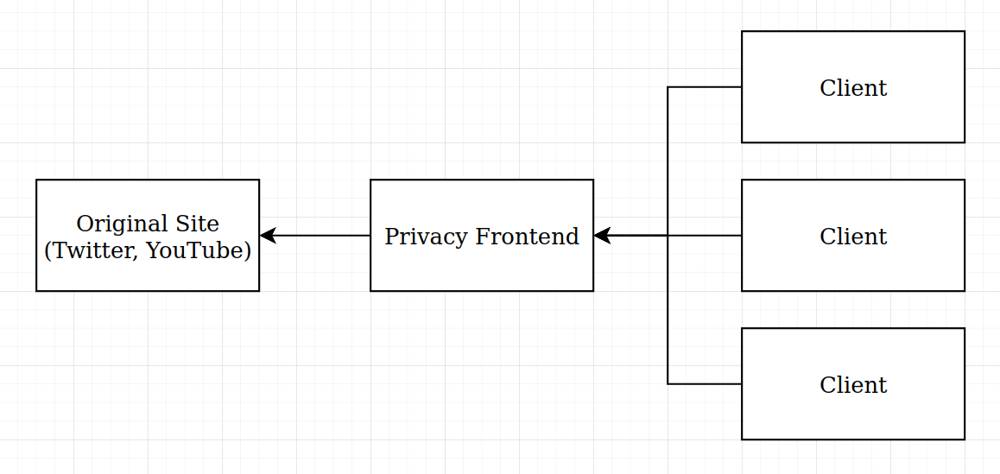
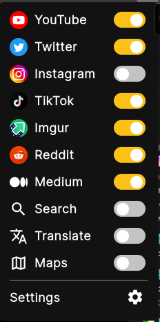
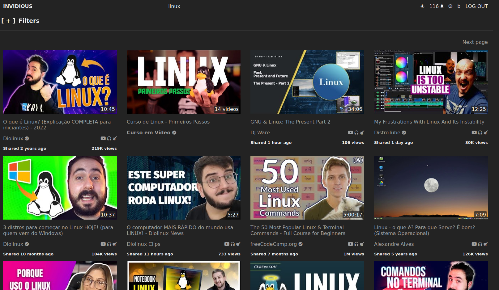
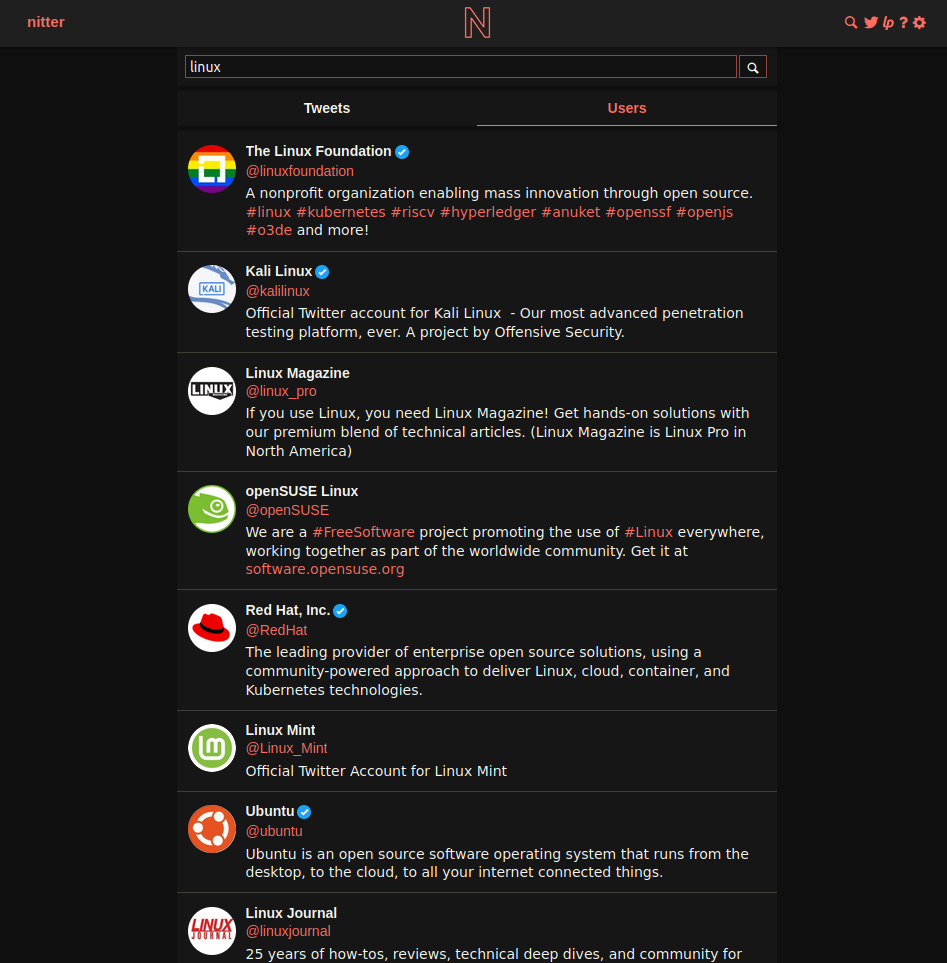
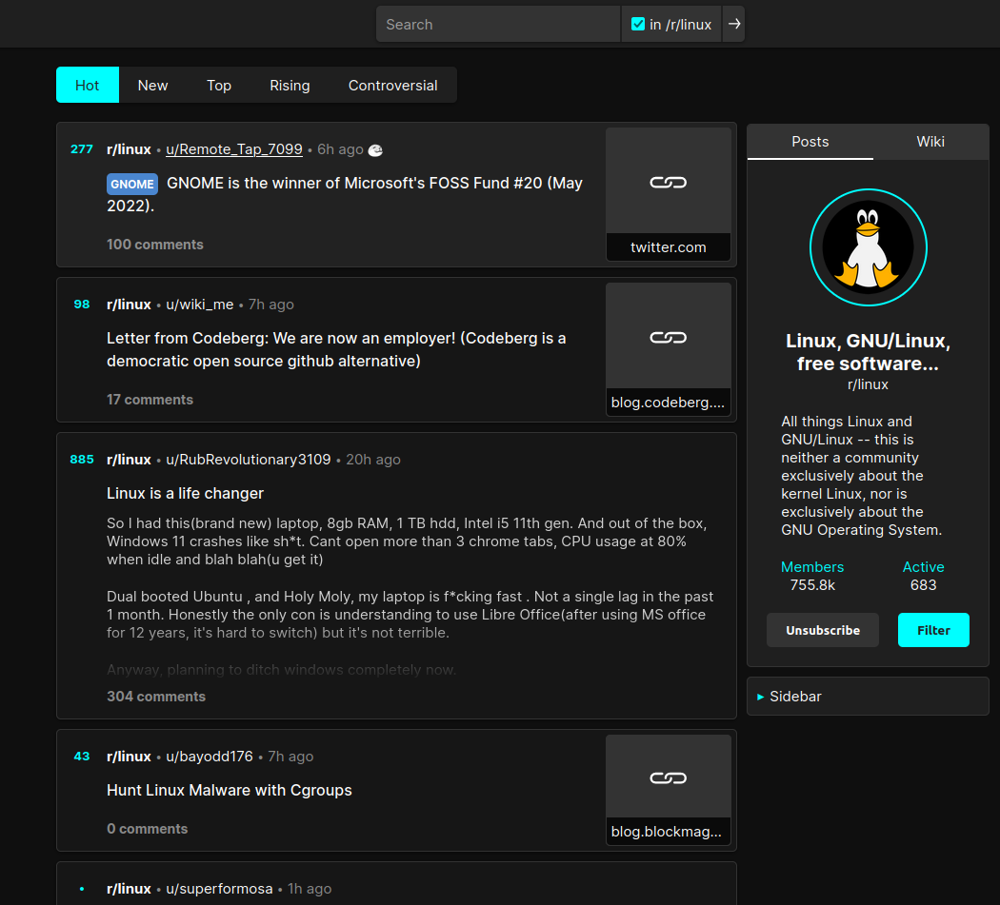
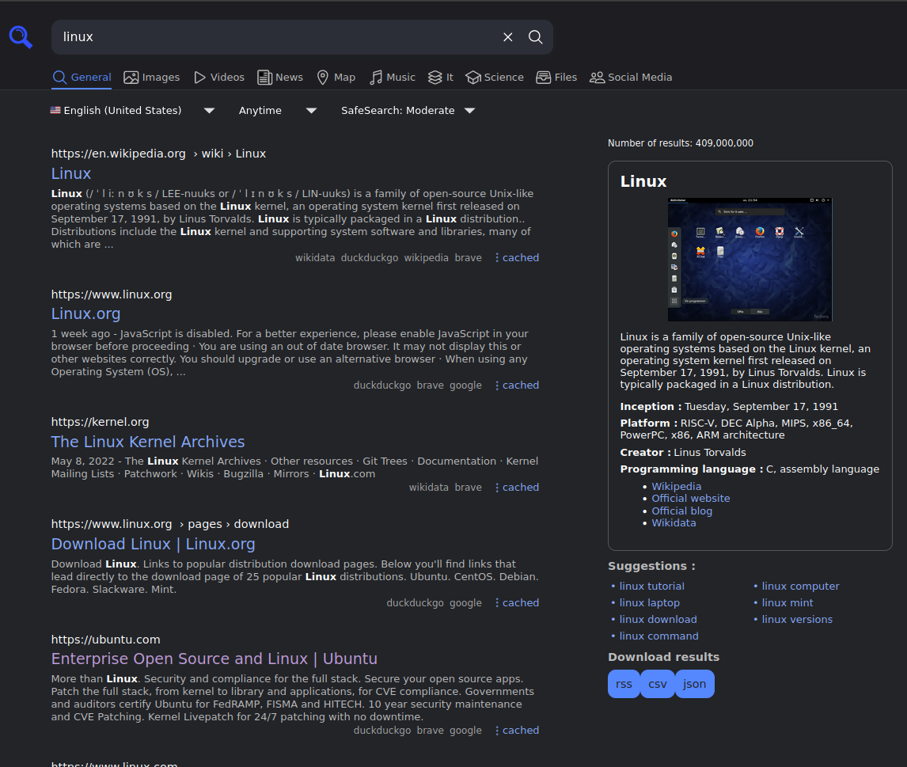

In an ideal world, relying on proprietary services should be optional. In reality, because most of the people around you uses
proprietary services every day, you ends up being obligated to consume content from those companies. Chances that if you want
to see a photo of your friend, it will be in Instagram, or some news will be posted in Twitter. Also because those companies
relies on selling ads and working with user data, they build their websites in a way that incentivizes you to spend as much time
as possible in those platforms.

So how to minimize the amount of information you give to those companies? The simplest option is to use and AD Blocker, that will
hide ADS from the pages and also block requests and cookies from known companies. And that's fine for most people, as you'll have
the same intended experience from the company providing the service while keep at least some level of privacy. This is not guaranteed
to work forever tho, as [Google is trying to restrict AD Block capabilities in Chromium browsers](https://9to5google.com/2020/12/09/chrome-88-beta-extension-manifest-v3/).
If you care about your privacy, you should be using Firefox anyway, as Mozilla already confirmed that Manifest v3 will support ad blocking
in Firefox.

Using Firefox, you also has the option of using nice privacy oriented features, like [Multi Account Containers](https://addons.mozilla.org/en-US/firefox/addon/multi-account-containers/),
that isolate your activity between conatiners, so you can isolate proprietary apps. [Facebook Container](https://addons.mozilla.org/en-US/firefox/addon/facebook-container/)
automates the process of isolating Facebook data, so Facebook cannot see your activiy across the internet with the cookies that it creates
when you login into their services (they will see your activity but as an user without an account). Consider also using [Total Cookie Protection](https://blog.mozilla.org/security/2021/02/23/total-cookie-protection/)
to have better cookie isolation and a good ad blocker, like [Ublock Origin](https://addons.mozilla.org/en-US/firefox/addon/ublock-origin/).

However, in some situations, its still bad to rely on the sites made by those companies. Twitter for example, asks you to login into their
services everytime you read a tweet, and their website is not so great on mobile. Instagram does not let you see more than 1 page of posts without loggin in,
and you'll be tracked as sometimes ad blockers cannot differentiate between content and tracking.

And for this we have Privacy Frontends, a series of projects that reimplements Social Media websites while respecting your privacy. The idea is simple: those
projects offers a way for people to self host a server that communicates with the original site, parse its data and returns it to you. This way, multiple people
can connect to the same server, and the company cannot know that you are consuming their servies (they see the server as an user, but cannot see the actual users connecting to the server).

In this article I'll talk about how to replace you usage of proprietary services with privacy friendly websites, how to passively consume content from those sites, and an overview
of my favourite projects.

# LibRedirect - Redirect to Privacy Frontend Services

Let's say a friend of yours sends you a YouTube link. How to watch that video easily, sending as litte data as possible to Google? [LibRedirect](https://github.com/libredirect/libredirect)
allows you to paste the YouTube link in your browser, and it automatically redirects you to the corresponding privacy frontend service (Invidious in this example), allowing you to watch
the video without connecting to Google servers. Its by far the easiest way to get started, and it allows you to configure redirection per service.

Inside the extension settings, you can confgure instances per service, enable and disable services, and much more.

# RSS - Consuming content passively

One thing you might think while using privacy frontends is that almost all of them does not have account managment built in. This happens because those projects
grabs public data from provider's website, and does not communicate with private API's for authentication. Majority of those companies forbidden access to private API's
outside their website in the Term of Services, so ther is no incentive for those projects to have account managment anytime soon.

The best alternative is to rely on an old, but reliable content consuption protocol: RSS. Almost all of those services allows you to create an RSS feed of the accounts/users/subreddits
you follow, so you can use your favourite RSS reader to create your personal feed of content and keep updated with latest tweets, YouTube videos, and so on.

In each service bellow, I'll show how to generate a feed for you to use. If you need a RSS client, try [NewsFlash](https://flathub.org/apps/details/com.gitlab.newsflash)

# Invidious (YouTube)

Invidious reimplements YouTube for you. You can create your account (unrelated to YouTube's one), manage subscriptions, watch videos and search for YouTube content.
If offers two modes, one the videos goes from Google Services directly to your machine, and another one where videos are proxied to the instance, so Google cannot
see your IP. Use the first one to save bandwitch from the public instance when possible.

- [List of available instances](https://api.invidious.io/)
- RSS: Inside the channel page, look for an RSS icon. then copy the RSS feed.
- My reccomendation: [YewTube](https://yewtu.be/)
- [Source code](https://github.com/iv-org/invidious)

# Nitter (Twitter)

Nitter is a reimplementation of Twitter. This one is actually better than Twitter itself, as you don't have ads, can consume content without any tipe of annoying banner and has a much cleaner
interface. It communicates to Twitter API, and has a token rotation that allows the instance to authenticate automatically, also providing RSS
functionality that Twitter removed many years ago.

- [List of available instances](https://github.com/zedeus/nitter/wiki/Instances)
- RSS: Just append `/rss` to the user URL. For example, for `https://twitter.com/linuxfoundation`, the RSS feed will be `https://nitter.net/linuxfoundation/rss`
- My reccomendation: [nitter.net](https://nitter.net/)
- [Source Code](https://github.com/zedeus/nitter)

# Bibliogram (Instagram)

Bibliogram tries to reimplement Instagram. Because of how Facebook is agressive against third party services using their data, usually Biblogram instances are being
rate limited or shut down. So expect to be only able to see recent posts from a Biblogram instance. If you really need to use instagram, use Facebook Container Firefox
Extension and disable this redirect in LibRedirect configuration

- [List of available instances](https://git.sr.ht/~cadence/bibliogram-docs/tree/master/docs/Instances.md)
- RSS: Inside the profile page, there is a RSS feed link bellow profile picture
- My reccomendation: [bibliogram.pussthecat.org](https://bibliogram.pussthecat.org/)
- [Source Code](https://sr.ht/~cadence/bibliogram/)

# Libreddit (Reddit)

Libreddit reimplements Reddit without ads, in a more modern style than old Reddit interfacce, and in a realiable way. It allows you to subscribe to subreddits locally,
by placing a cookie in your browser. This way you can have the same experience that you have in Reddit, but in a private way. As many privacy frontends, it does not support
authenticated actions, as commenting to posts, or posting.

- [List of available instances](https://github.com/spikecodes/libreddit)
- RSS: It does not have support. If you really want RSS, check [Teddit](https://codeberg.org/teddit/teddit), an alternative that provides this.
- My reccomendation: [libreddit.spike.codes](https://libreddit.spike.codes/)
- [Source Code](https://github.com/spikecodes/libreddit)

# SearXNG - Metasearch engine

SearXNG is a metasearch engine. When you search for a term, it connects to many search engines (Google, DuckDuckGo, Bing, etc.) to fetch results. Then it classifies it
and returns to you in a friedly interface, without trackers and javascript. It is actually better than searching on Google, because it can query multiple engines at the same
time.

- [List of available instances](https://searx.space/)
- RSS: If enabled by the instance host, you'll find link for RSS feed after you do some search in the right
- My reccomendation: [searx.pussthecat.org](https://searx.pussthecat.org/)
- [Source Code](https://github.com/searxng/searxng)

# Conclusion

If you're using this services, consider donating to the project and people that are hosting those instances. Its not free proxying GB of data every day so you don't need to
connect to the proprietary services yourself.

Also if you are interested to self host some of those instances (I reccoment trying to self host SearXNG. Its super simple and works really well), you can check [this repository](https://github.com/PussTheCat-org/PussTheCat.org-Configs),
where you'll find docker, nginx and service configuration files to host many of those services privately.

We live in a unique era where data is so important to those companies that sites are built to collect as many data as possible, and to show you content in a way to keep you
engaged into their network. After I've started using privacy frontend services, specially Niiter, Libreddit and SearXNG, its strange to go back to Twitter, Reddit and Google again
and see the amount of useless information those sites has in order to keep you engaged and show you ads.

Thanks for reading!
